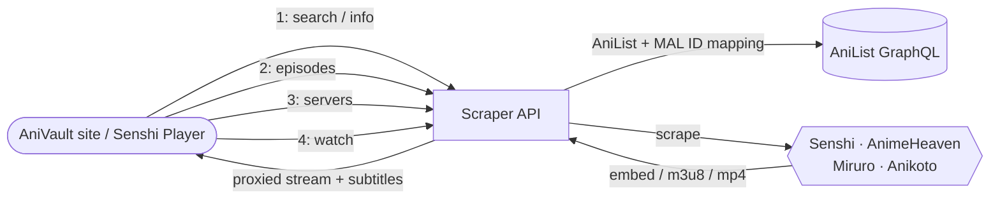

<div align="center">

# AniVault Scraper API

**The video-sourcing backend for [AniVault](https://www.anivault.co).**

Resolves anime titles → episodes → live, playable streams (sub & dub) across
multiple streaming providers, with built-in HLS/subtitle/video proxying so
everything plays with clean CORS, no matter what the upstream server sends.

</div>

---

## How it works



A typical playback flow is `search → info → episodes → servers → watch`:
resolve the anime, list its episodes, list which servers have episode N,
then resolve that server into an actual playable stream. `/watch` can also
be called directly if you already know the source/episode.

## Sources

| Source | Status | Notes |
|---|---|---|
| **Senshi** (senshi.live) | ✅ Verified | Behind Cloudflare — requires **FlareSolverr** to solve the challenge before scraping |
| **AnimeHeaven** (animeheaven.me) | ✅ Verified | Not behind Cloudflare, no FlareSolverr needed — direct MP4 sources |
| **Anikoto** (anikoto.net) | ✅ Verified | Megacloud/Megaplay decryption + a direct-CDN side channel |
| **Miruro** (miruro.tv) | ⚠️ **Offline** | Upstream pipe endpoint is currently down — requests will fail until it comes back |
| **ReAnime** (reanime.to) v2 | ⚠️ Verify | AniList-ID direct; custom WASM+AES decrypt, may need updates if the site rotates its obfuscation |
| **AniNeko** (anineko.to) v2 | ⚠️ Verify | AniList-ID direct via title search/match |
| **2dHive** (2dhive.com) v2 | ⚠️ Verify | Resolves via MAL ID (from AniList), inline HLS + MegaPlay fallback |
| **AniZone** (anizone.to) v2 | ⚠️ Verify | AniList-ID direct via title search/match, sub only |
| **KAA / KickAssAnime** (kaa.lt) v2 | ⚠️ Verify | AniList-ID direct via title search/match |

FlareSolverr runs as a separate service; set `FLARESOLVERR_URL` in the
environment so Senshi requests can solve the Cloudflare challenge. The API
also pings it periodically to keep it warm on free-tier hosts.

## Endpoints

All routes are mounted under `/api`.

### `GET /api/search?q=`
Search AniList for a title.
```
GET /api/search?q=naruto
→ { query, count, results[] }
```

### `GET /api/info`
Resolve an anime's AniList/MAL IDs and per-source site IDs.
| Param | Required | Notes |
|---|---|---|
| `anilistId` | one of these | |
| `malId` | one of these | |
```
GET /api/info?malId=20
→ { anilistId, malId, title, siteIds: { zoro, animeheaven, anikoto, ... } }
```

### `GET /api/episodes`
List episodes for a title on a given source.
| Param | Required | Notes |
|---|---|---|
| `anilistId` / `malId` | yes* | *unless `heavenId` is used with `source=animeheaven` |
| `source` | no | `senshi` \| `animeheaven` \| `miruro` \| `anikoto` (default `senshi`) |
| `heavenId` | no | manual AnimeHeaven show id |
```
GET /api/episodes?anilistId=20&source=senshi
→ { anilistId, malId, title, source, siteId, count, episodes[] }
```

### `GET /api/servers`
List available servers (sub/dub) for a specific episode.
| Param | Required | Notes |
|---|---|---|
| `anilistId` / `malId` | yes* | |
| `ep` | **yes** | episode number |
| `type` | no | `sub` \| `dub` \| `all` (default `sub`) |
| `source` | no | default `senshi` |
| `heavenId` | no | manual AnimeHeaven show id |
```
GET /api/servers?anilistId=20&ep=1&type=sub&source=senshi
→ { anilistId, malId, title, episode, type, source, servers[] }
```

### `GET /api/watch/:source/:id/:ep/:type`
Resolve a real, playable stream for an episode — the main playback endpoint.
| Path param | Notes |
|---|---|
| `source` | `senshi` \| `animeheaven` \| `miruro` \| `anikoto` |
| `id` | AniList id (or `mal-{id}`, or AnimeHeaven id) |
| `ep` | episode number |
| `type` | `sub` \| `dub` |

| Query param | Notes |
|---|---|
| `server` | prefer a specific server by name |
| `strict` | `1`/`true` — only use `server`, don't fall back to others |

```
GET /api/watch/senshi/20/1/sub
GET /api/watch/miruro/20/1/sub?server=bonk-sub
→ { embedUrl, m3u8, hlsProxyUrl, playbackMode, subtitles[], server, availableServers[], ... }
```

### `GET /api/watch`
Same as above, as query params instead of a path — useful when building a
URL dynamically.
```
GET /api/watch?source=senshi&anilistId=20&ep=1&type=sub
```

### `GET /api/proxy/hls?url=&ref=`
Proxies an `.m3u8` playlist (and rewrites internal segment/key URIs to also
route through this proxy) so the browser never hits the upstream CDN
directly — fixes CORS and Referer/Origin restrictions.

### `GET /api/proxy/subtitle?url=&ref=`
Proxies a subtitle track with open CORS, converting SRT → WEBVTT on the fly
if needed.

### `GET /api/proxy/video?url=`
Proxies a direct MP4 stream (used by AnimeHeaven), forwarding `Range`
requests for seeking.

### `GET /api/health`
```
→ { status, version, sources[], uptime, cache, timestamp }
```

### v2 sources: ReAnime, AniNeko, 2dHive, AniZone, KAA

These don't go through the site-ID mapper above — they resolve straight from
an AniList ID by searching the target site and picking the best title match
themselves (same idea as Anikoto, just kept in their own route family since
they don't share the SOURCES/site-ID plumbing).

### `GET /api/v2/episodes/:provider/:anilistId`

`:provider` is one of `reanime`, `anineko`, `2dhive`, `anizone`, `kaa`.

```
GET /api/v2/episodes/reanime/21
GET /api/v2/episodes/anizone/21
```

### `GET /api/v2/watch/:provider/:anilistId/:audio/:ep`

`:audio` is `sub` or `dub` (AniZone is sub-only).

```
GET /api/v2/watch/reanime/21/sub/1
GET /api/v2/watch/kaa/21/dub/1
```

Live-test all five from the docs page → **v2 Tester** section, or in the
sidebar under **AniList Sources (v2)**.

### Debug (internal)
`GET /api/debug/miruro` and `GET /api/debug/miruro-sources` dump the raw
Miruro pipe response for a given provider/episode — used for diagnosing the
current Miruro outage, not part of the stable public surface.

## Tech stack

| | |
|---|---|
| Runtime | Node.js (Express), TypeScript |
| Scraping | Cheerio, Axios |
| Cloudflare bypass | FlareSolverr |
| Caching | node-cache (in-memory), optional Upstash Redis |
| Hosting | Railway |

## Status

Senshi, AnimeHeaven, and Anikoto are live and verified. Miruro is currently
**offline** upstream — its pipe endpoint is down, and the debug routes above
exist specifically to track when it comes back.

